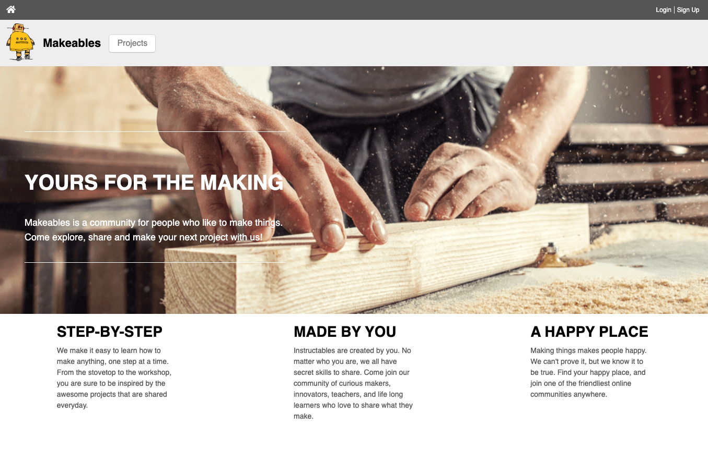

Makeables is a full stack web application, influenced by Instructables, that provides makers, builders, DIY'ers and the like an online space to share their creations and the processes it took to make them. Users can also explore the community's ever growing collection of projects, learn from fellow makers and share tips, tricks and ideas.

Check out the app here! [Makeables](https://makeables.herokuapp.com/#/)

## Technologies Used

Makeables was constructed utilizing a combination of Ruby on Rails, Postgres, React, Redux, JavaScript, HTML, and CSS. 
Ruby on Rails was used to create a Model-View-Controller Architecture with Postgres used as the database. React and Redux were then incorporated to dynamically connect the backend to the frontend. And the frontend was structured with HTML and styled with CSS. 

## Features

### Projects

Users can easily publish titled personal projects along with a photo of the finished build. Prior to publication users can preview their photo and change it if need be. This temporary storage of the project's title and the previewing of a photo are handled on the frontend via local storage. Here's a snippet displaying the logic used to accomplish this: 

    handleSubmit(e) {
        e.preventDefault();
        const formData = new FormData();
        formData.append('project[title]', localStorage.getItem('title'));
        localStorage.removeItem('title');
        if (this.state.photoFile) {
            formData.append('project[project_photo]', this.state.photoFile);
        }
        if (this.props.formType === 'Publish Makeable') {
            this.props.createProject(formData)
                .then((project) => {
                    this.props.history.push(`/projects/${project.id}`)
                });
        } else {
            this.props.updateProject(formData)
                .then((project) => {
                    this.props.history.push(`/projects/${project.id}`)
                });
        }
    }

    previewFile(e) {
        const file = e.currentTarget.files[0];
        const preview = document.querySelector('.img_preview');
        const reader = new FileReader();
        reader.onloadend = () => {
            preview.src = reader.result;
            this.setState({photoFile: file, photoUrl: reader.result});
        };
        if (file) {
            reader.readAsDataURL(file);
        } else {
            this.setState({ photoUrl: "", photoFile: null });
        }
        this.projectImage = true;
    }

Once a project is published Rails Active Storage is utilized to access and upload a user's photo which is in turn stored via Amazon's AWS S3 cloud storage system.

### Steps

Users can add step by step instructions to their published projects as well as edit and remove any steps that they would like to change or correct. Thier changes are instantly reflected upon submission and return to the corresponding Project's show page. As the Steps Component is nested within the parent component of the Project itslef, this update is handled with componentDidUpdate() and a call to fetchAllSteps on the condition that the current state of the Steps Component's properties no longer matches the previous state of the Steps Component's properties. This can be seen in the code snippet below.

    componentDidUpdate(prevProps) {
        if (prevProps.steps !== this.props.steps) {
            this.props.fetchAllSteps(this.props.projectId)
        }
    }

### Comments

Logged in users can comment on published projects. Should the commenter wish to edit or remove their comment they have the ability to do so.

## Planned Future Features

* Steps Photo - Users can add a photo to their steps.
* Step Numbering - As users add steps the steps are automatically numbered in assending order.
* Search - Users can search for projects by keyword(s). 
